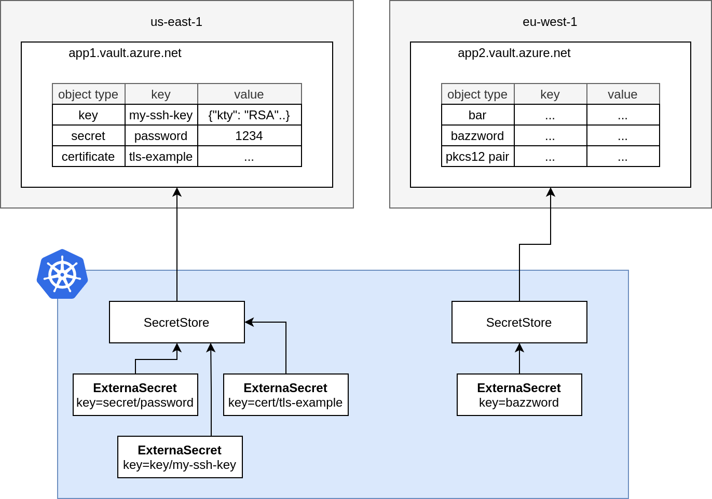

## Azure Key vault

External Secrets Operator integrates with [Azure Key vault](https://azure.microsoft.com/en-us/services/key-vault/) for secrets , certificates and Keys management.

### Authentication

At the moment, we only support [service principals](https://docs.microsoft.com/en-us/azure/key-vault/general/authentication) authentication.

#### Service Principal key authentication

A service Principal client and Secret is created and the JSON keyfile is stored in a `Kind=Secret`. The `ClientID` and `ClientSecret` should be configured for the secret. This service principal should have proper access rights to the keyvault to be managed by the operator

```yaml

```

### Update secret store
Be sure the `azkv` provider is listed in the `Kind=SecretStore`

```yaml

```

### Creating external secret

To create a kubernetes secret from the Azure Key vault secret a `Kind=ExternalSecret` is needed.

You can manage keys/secrets/certificates saved inside the keyvault , by setting a "/" prefixed type in the secret name , the default type is a `secret`. other supported values are `cert` and `key`

to select all secrets inside the key vault , you can use the `dataFrom` directive

```yaml

```

The operator will fetch the Azure Key vault secret and inject it as a `Kind=Secret`
```
kubectl get secret secret-to-be-created -n <namespace> | -o jsonpath='{.data.dev-secret-test}' | base64 -d
```

