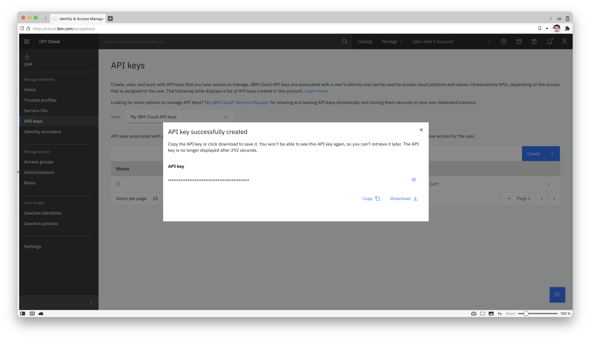

## IBM Cloud Secret Manager

External Secrets Operator integrates with [IBM Secret Manager](https://www.ibm.com/cloud/secrets-manager) for secret management.

### Authentication

At the moment, we only support API key authentication for this provider. To generate your key (for test purposes we are going to generate from your user), first got to your (Access IAM) page:


On the left, click "IBM Cloud API Keys":


Press "Create an IBM Cloud API Key":


Pick a name and description for your key:


You have created a key. Press the eyeball to show the key. Copy or save it because keys can't be displayed or downloaded twice.




#### API key secret

Create a secret containing your apiKey:

```shell
echo -n 'API_KEY_VALUE' > ./apiKey
kubectl create secret generic ibm-secret --from-file=./apiKey 
```

### Update secret store
Be sure the `ibm` provider is listed in the `Kind=SecretStore`

```yaml

```

To find your serviceURL, under your Secrets Manager resource, go to "Endpoints" on the left:


### Creating external secret

To create a kubernetes secret from the IBM Secrets Manager, a `Kind=ExternalSecret` is needed.

```yaml

```

Currently we can only get the secret by its id and not its name, so something like `565287ce-578f-8d96-a746-9409d531fe2a`.

### Getting the Kubernetes secret
The operator will fetch the IBM Secret Manager secret and inject it as a `Kind=Secret`
```
kubectl get secret secret-to-be-created -n <namespace> | -o jsonpath='{.data.test}' | base64 -d
```
